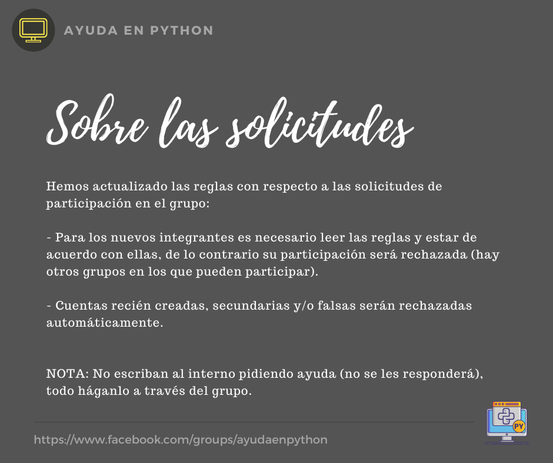

# Sobre las solicitudes

Hemos actualizado las reglas con respecto a las solicitudes de participación en el grupo:

- Para los nuevos integrantes es necesario leer las reglas y estar de acuerdo con ellas, de lo contrario su participación será rechazada (hay otros grupos en los que pueden participar).

- Cuentas recién creadas, secundarias y/o falsas serán rechazadas automáticamente.

NOTA: No escriban al interno pidiendo ayuda (no se les responderá), todo háganlo a través del grupo.

