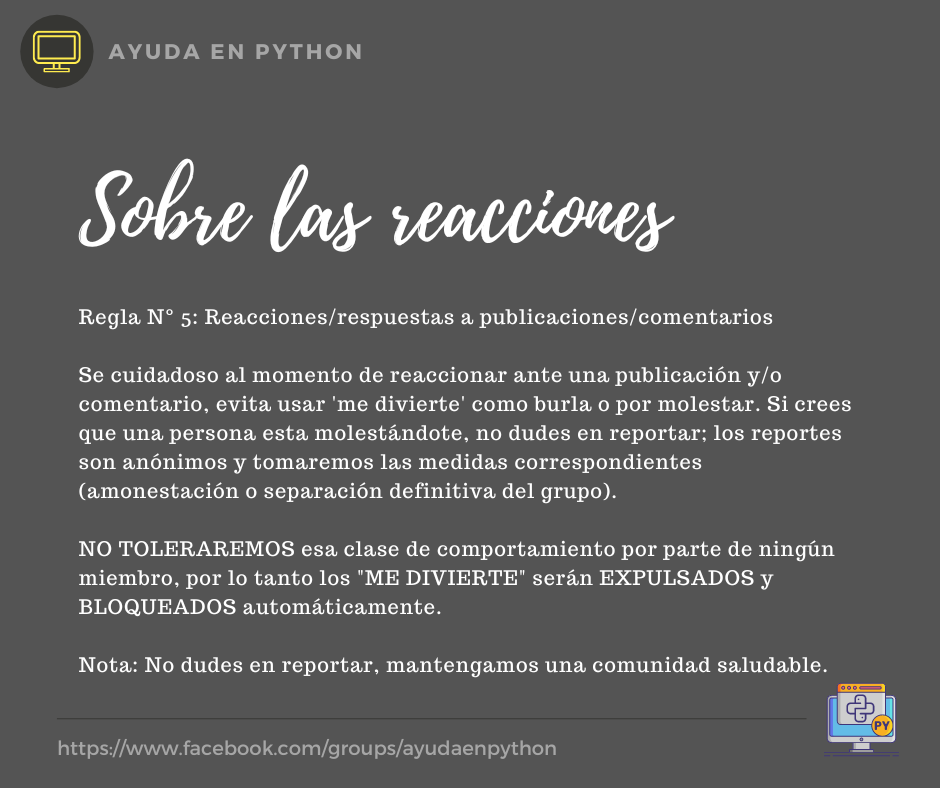

# Sobre las reacciones

-- Comunicado a todos los miembros de la comunidad --

> Regla N°5: Reacciones/respuestas a publicaciones/comentarios
>
> Se cuidadoso al momento de reaccionar ante una publicación y/o comentario, evita usar 'me divierte' como burla o por molestar. Si crees que una persona esta molestándote, no dudes en reportar; los reportes son anónimos y tomaremos las medidas correspondientes (amonestación o separación definitiva del grupo).

---

NO TOLERAREMOS esa clase de comportamiento por parte de ningún miembro, por lo tanto los "ME DIVIERTE" serán EXPULSADOS y BLOQUEADOS automáticamente.

Nota: No dudes en reportar, mantengamos una comunidad saludable.

Enlaces:
https://www.facebook.com/groups/ayudapython/about
https://github.com/AyudaEnPython/AyudaEnPython/blob/main/_readme/reglas.md

---

A nuestros demás miembros les pedimos que REPORTEN a aquellos que le dan "ME DIVIERTE" en sus publicaciones.

