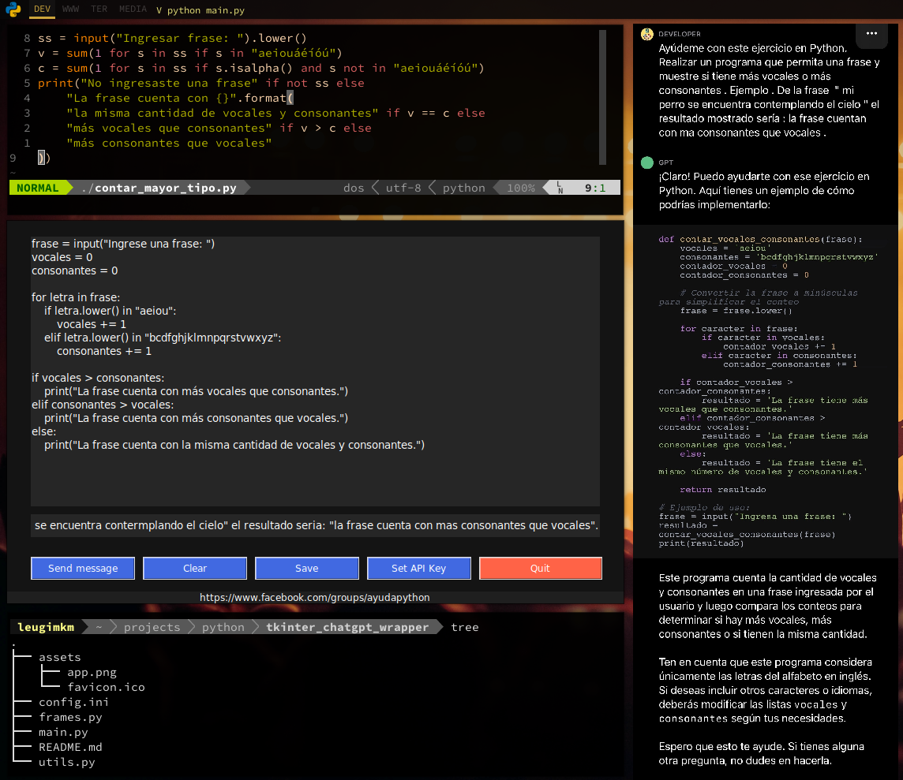

# Wrapper de ChatGPT

TLTR: Añadido un wrapper (gui: tkinter) de ChaGPT en (ir a apps): https://github.com/AyudaEnPython/Prompting

ChatGPT es de utilidad para varias cosas (sobre todo en documentación) pero va a depender en mayor parte del modelo y del prompt usados.

Tomando una publicación del grupo (ayuda con un ejercicio) como prompt para ChatGPT , se puede apreciar esas diferencias en la imagen: diferentes respuestas en la parte derecha y parte central izquierda debido al modelo. Además, posibles errores como ingresar frases con tilde debido a que el prompt no es lo suficientemente específico. La parte superior izquierda es solo una de las tantas formas de resolver el ejercicio sin necesidad de usar ChatGPT.

Hace un par de semanas lanzamos este repositorio:
https://github.com/AyudaEnPython/Prompting
En esta repo esta el curso de DeepLearning traducido para aquellos que tengan dificultad con el idioma y se ha añadido info extra como también algunas mejoras.

Acabamos de actualizarlo y hemos añadido la aplicación que se aprecia en la imagen (parte central izquierda). Si algo de ustedes tienen alguna sugerencia, propuesta y/o funcionalidad en mente, pueden abrir un "issue" en el repo o comentar en esta publicación. También seria de gran ayuda si contribuyen con el repositorio.

P.D.: El resaltado de sintaxis de la aplicación esta "en pendiente" por falta de tiempo. Si alguien quisiera añadir esa funcionalidad pueden guiarse de este módulo de mi repo personal: https://github.com/leugimkm/code2img/blob/main/code2img/creator.py

