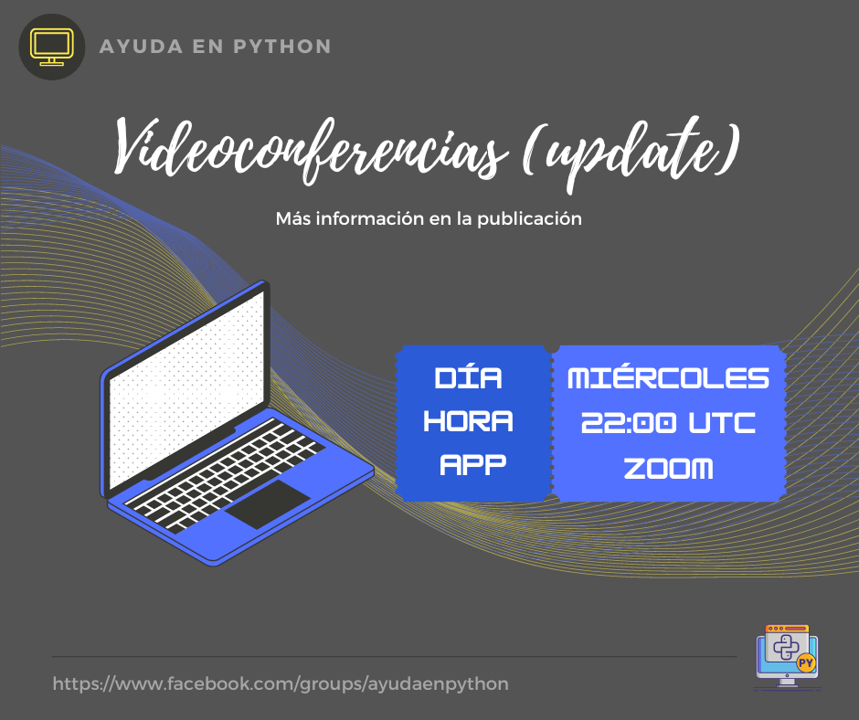

# Videoconferencias (update)

-- Comunicado para todos los miembros de la comunidad --

Seguimos adelante con nuestra propuesta de realizar videoconferencias y, hasta el momento, los detalles sobre ellas son las siguientes:

- Editor: Visual Studio Code (VS Code)
- Días: Miércoles
- Hora: 22:00 (UTC)
- Aplicación: Zoom
- Frecuencia: Semanal (puede variar según la participación)

Nota: Pueden seguir votando en las encuestas si aún no lo han hecho.

Lo más probable es que iniciemos a mediados de quincena de mes y, antes de ello, también vamos a tener algunas videoconferencias de prueba (publicaremos los enlaces con 30 minutos de antelación). La idea es que estos "test" nos sirvan para asegurarnos de que todo funcione correctamente cuando lancemos las videoconferencias oficiales que estamos proponiendo.

---

Sus opiniones son muy importantes para nosotros. Si tienen otras sugerencias sobre cómo podemos mejorar la participación y el valor de este grupo, ¡no duden en compartirlas!

