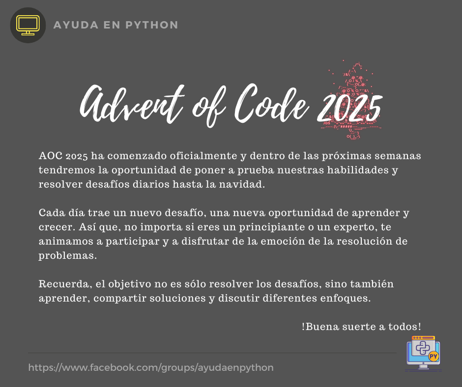

# Advent of Code 2025

-- Comunicado a todos los miembros de la comunidad --

Para este 2025, "Adevent of Code" llega con cambios importantes:
- Después de 10 años manteniendo el mismo ritmo, el creador (Eric Wastl) decidió reducir la cantidad de retos. Seguirá empezando el 1 de diciembre pero el evento terminará a mitad de mes.
- Se tomó la decisión de eliminar la tabla de clasificación global para recuperar el espíritu original: disfrutar, aprender y resolver retos por diversión.

Para mayor información pueden el siguiente enlace: https://adventofcode.com/2025/about

---

AOC 2024 ha comenzado oficialmente y dentro de las próximas semanas tendremos la oportunidad de poner a prueba nuestras habilidades y resolver desafíos diarios hasta la navidad.

Cada día trae un nuevo desafío, una nueva oportunidad de aprender y crecer. Así que, no importa si eres un principiante o un experto, te animamos a participar y a disfrutar de la emoción de la resolución de problemas.

Recuerda, el objetivo no es sólo resolver los desafíos, sino también aprender, compartir soluciones y discutir diferentes enfoques.

¡Buena suerte a todos!

